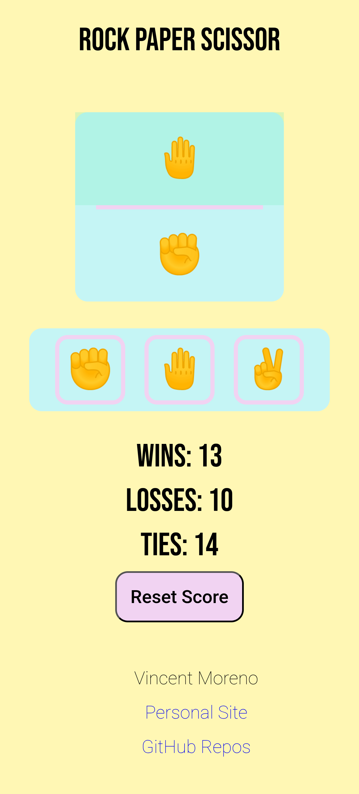
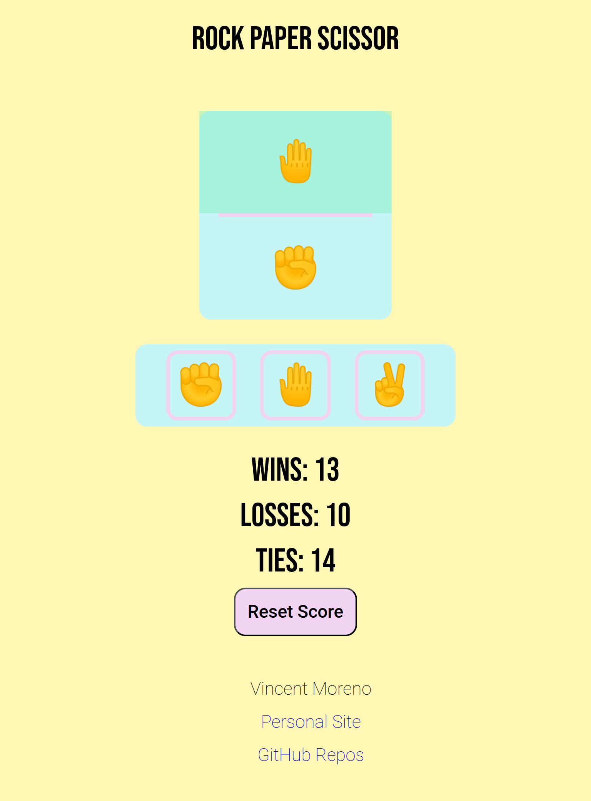
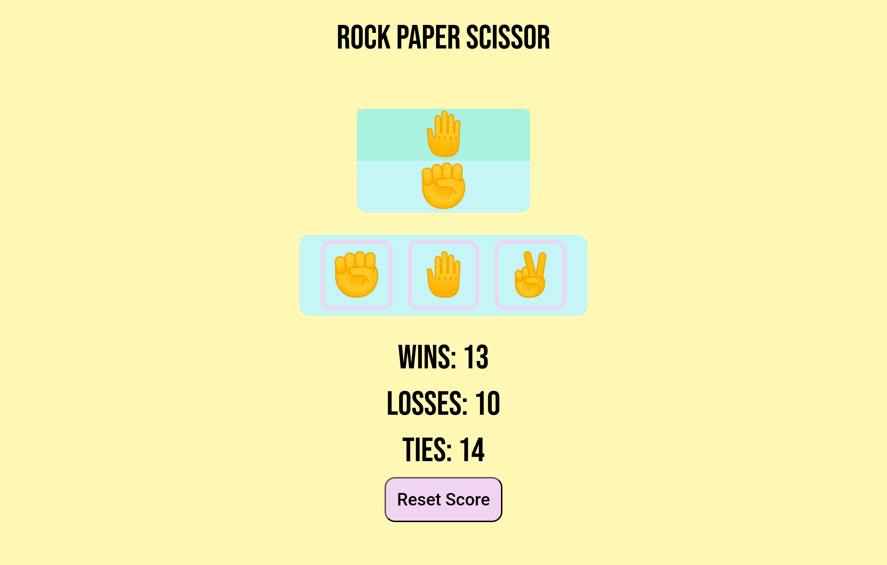

# rock_paper_scissors

This project is the Rock Paper Scissors game built as part of The Odin Project’s Foundations curriculum.  

It started as a console-based program and was later enhanced with a mobile-first graphical interface using a branching workflow introduced in the "Revisiting Rock Paper Scissors" lesson.

## Features
- Randomized computer choices  
- User input via prompt() and console output  
- Functions to handle game logic and score tracking  

## Tech Stack
- JavaScript (vanilla)  
- HTML  
- CSS  

## Extra Features
- Mobile-first design for mobile, tablet, and desktop responsiveness  
- Unlimited play instead of fixed rounds  
- Graphical interface with buttons for player input  
- Live score display and in-page result updates  
- Reset score functionality for new game sessions  
- Local saving of scores using JSON and localStorage  
- Visual feedback: green flash for a win, red flash for a loss  
- Git branching workflow: developed the UI in a feature branch and rebased into main  

## Preview

  
  
  

## Future Improvements
- Add animations and CSS transitions for smoother UX  
- Improve accessibility (keyboard navigation, ARIA roles)  
- Add "best-of" mode and alternate game variations  
- Optional sound effects or simple AI strategies  

## Acknowledgements
- Built as part of The Odin Project’s [Foundations course](https://www.theodinproject.com/lessons/foundations-revisiting-rock-paper-scissors)  
- Fonts provided by [Google Fonts](https://fonts.google.com/)
